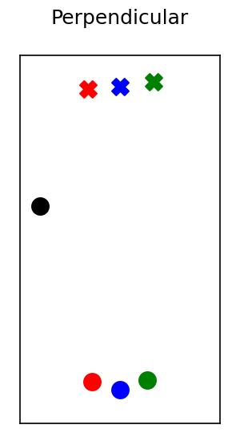
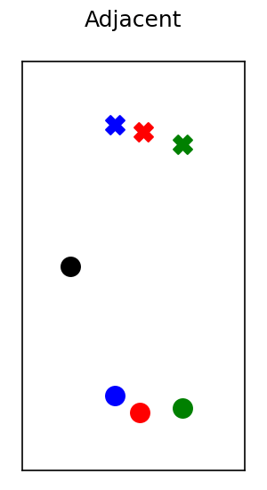
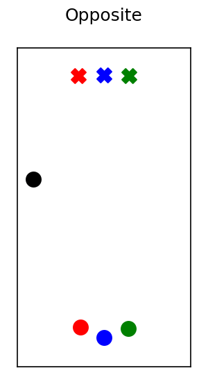
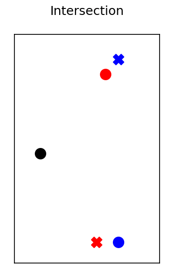
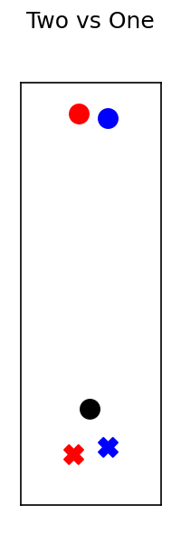

# A Study in Zucker: Insights on Human-Robot Interaction

This repository holds the processed human-robot interaction data recorded at Clemson's Zucker Graduate Education Center in May 2020. For the associated analysis, please look at our paper on ArXiv: [A Study in Zucker: Insights on Human-Robot Interaction](https://arxiv.org/abs/2307.08668). 

**Abstract** -- In recent years there has been a large focus on how robots can operate in human populated environments. In this paper, we focus on interactions between humans and small indoor robots and introduce a new human-robot interaction (HRI) dataset. The analysis of the recorded experiments shows that anticipatory and non-reactive robot controllers impose similar constraints to humans' safety and efficiency. Additionally, we found that current state-of-the-art models for human trajectory prediction can adequately extend to indoor HRI settings. Finally, we show that humans respond differently in shared and homogeneous environments when collisions are imminent, since interacting with small differential drives can only cause a finite level of social discomfort as compared to human-human interactions. 

This dataset contains two different agent types (robot and human) in several scenarios. The robot switched between 3 different motion controllers (Linear, NHTTC, and CADRL) over multiple different scenarios with different permutations of human agents. There are also scenes without the robot for a baseline. Examples of the 7 scenes in the dataset are shown below. The colored agents are pedestrians, while the black agent is the robot. 

|        Perpendicular           |         Adjacent          |          Opposite         |  Intersection |
| ------------------------------ | ------------------------- | ------------------------- | ------------- |
|  |  |  | 

|         Overtake               |       Two vs. One         |       Head-to-Head          |
| ------------------------------ | ------------------------- | --------------------------- |
|   |  |  |


## Using the Dataset
To facilitate further analysis of our dataset, we provide a simple Python class to query our dataset based on the controller, scene, and agent indices. This code is in the `scripts/map_reader.py` file. The class is instantiated with a `map.csv` file and a root directory where the data is stored. An example of querying all files that use the CADRL controller on the Intersection scene is shown below:

```python3
zdm = ZuckerDatasetMap("./data/map.csv", "./data")
print(
    zdm.get_by(idx=3, scene=Scene.INTERSECTION, controller=Controller.CADRL)
)
```

This returns a `frozenset` containing the paths of the `.csv` files. The ID of the agent is the first column and is consistent across the dataset; the robot always has ID -1.

## Citation
If you use this dataset or find it useful, please cite it as below:
```bibtex
@misc{day2023zucker,
      title={A Study in Zucker: Insights on Human-Robot Interactions}, 
      author={Alex Day and Ioannis Karamouzas},
      year={2023},
      eprint={2307.08668},
      archivePrefix={arXiv},
      primaryClass={cs.RO}
}
```
